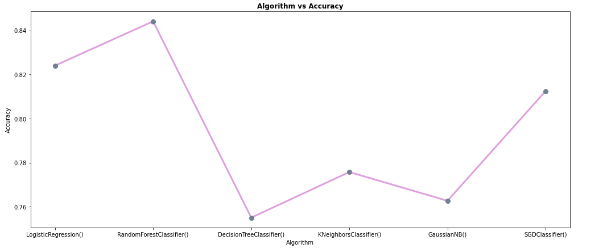

# New York City Airbnb Open Data Classification Model

**Context**

Airbnb is an online marketplace that connects people who want to rent out their homes with people who are looking for accommodations in specific locales and hospitality service for people to lease or rent short-term lodging including holiday cottages, apartments, homestays, hostel beds, or hotel rooms. Basically they provide the platform that is shared by hosts and visitors worldwide. Since 2008, guests and hosts have used Airbnb to expand on traveling possibilities and present more unique, personalized way of experiencing the world. This dataset describes the listing activity and metrics in NYC, NY for 2019. Lets look at the dataset once.

we can see our dataset has 48895 data and 16 columns. Lets try to understand about the columns we've got here.

id : a unique id identifying an airbnb lisitng

name : name representating the accomodation

host_id : a unique id identifying an airbnb host

host_name : name under whom host is registered

neighbourhood_group : a group of area

beighbourhood : area falls under neighbourhood_group

latitude : coordinate of listing

longitude : coordinate of listing

room_type : type to categorize listing rooms

price : price of listing

minimum_nights : the minimum nights required to stay in a single visit

number_of_reviews : total count of reviews given by visitors

last_review : date of last review given

reviews_per_month : rate of reviews given per month

calculated_host_listings_count : total no of listing registered under the host

availability_365 : the number of days for which a host is available in a year.

latitude and longitude has represented a co-ordinate, neighbourhood_group, neighbourhood and room_type are columns of categorical type. last_review is a column of date type, we will convert it as required.

**Aim**

Analyse the categorical feature room_type : 'Private room', 'Entire home/apt', 'Shared room' based on neighbour_hood & price range in almost all neighbourhoods.Use a
Classification technique where we categorize data into a given number of classes. check accuracy of classification model.

**Outcome**

***As we can see from above graph the base ML algorithm(Decision Tree) accuracy is 75% and highest ML alogrithm (Random forest) accuracy is 84%****

